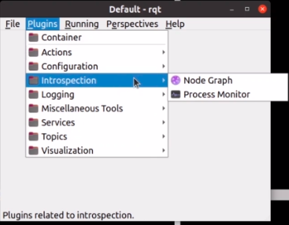
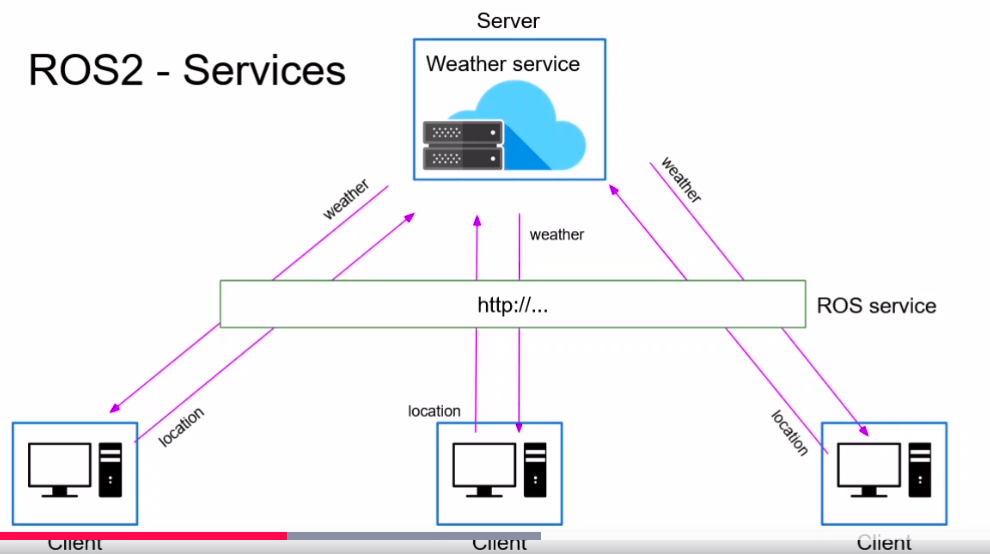

# ROS2 For Beginners

## Requirements
* Ubuntu 20

## Instructions

* Install the latest ROS2 distribution with LTS. Find the distributions
  [here](https://index.ros.org/doc/ros2/Releases/).

* We will install [ROS2 Foxy](https://index.ros.org/doc/ros2/Installation/Foxy/).

* Install locales first
```
locale  # check for UTF-8

sudo apt update && sudo apt install locales
sudo locale-gen en_US en_US.UTF-8
```

* We will install ROS2 via Debian Packages.
```
sudo apt update && sudo apt install curl gnupg2 lsb-release
curl -s https://raw.githubusercontent.com/ros/rosdistro/master/ros.asc | sudo apt-key add -
sudo sh -c 'echo "deb [arch=$(dpkg --print-architecture)] http://packages.ros.org/ros2/ubuntu $(lsb_release -cs) main" > /etc/apt/sources.list.d/ros2-latest.list'
```

* Install all packages
```
sudo apt update
sudo apt install ros-foxy-desktop
```

* This is optional. Can be useful for python development
```
sudo apt install -y python3-pip
pip3 install -U argcomplete
```

### Try some examples

* Start a talker
```
source /opt/ros/foxy/setup.bash
ros2 run demo_nodes_cpp talker
```

* In another terminal, start listener

```
source /opt/ros/foxy/setup.bash
ros2 run demo_nodes_cpp talker
```

### Install ROS2 Build tool - Colcon

```
sudo apt install python3-colcon-common-extensions
```

* Enable auto-complete for colcon
```
source /usr/share/colcon_argcomplete/hook/colcon-argcomplete.bash
```

### Sourcing
Add the following to your .bashrc
```
# Source ROS2 Foxy
source /opt/ros/foxy/setup.bash
# Ros2 workspace
source ~/ros2_ws/install/setup.bash

# Source colcon argcomplete (For Ros2)
source /usr/share/colcon_argcomplete/hook/colcon-argcomplete.bash
```

### Create workspace and build

```
mkdir ros2_ws
cd ros2_ws
mkdir src
colcon build
source install/setup.bash
```
Note: There is also local_setup.bash inside install folder. This sources only the local
directory. We don't need to know about this nuance at this stage.

### Create a Python package

```
cd ~/ros2_ws/src/
ros2 pkg create my_py_pkg --build-type ament_python --dependencies rclpy
# A folder named my_py_pkg is created. You place your scripts inside my_py_pkg/my_py_pkg
# directory
cd ~/ros2_ws
colcon build
OR
colcon build --packages-select my_py_pkg
```

### Create a C++ package

```
cd ~/ros2_ws/src/
ros2 pkg create my_cpp_pkg --build-type ament_cmake --dependencies rclcpp
cd ~/ros2_ws/
colcon build
OR
colcon build --packages-select my_cpp_pkg
```

### ROS2 Nodes
* Subprograms in your application, responsible for only one thing.
* Combined into a graph.
* Communicate with each other through topics, services, and parameters.


Benefits:
* Reduce code complexity.
* Fault tolerance.
* Can be written in Python, C++, .... One node can be written in Python and another in C++
  and they can communicate easily with each other.


## ROS2 Language Libraries

### RCL
* Ros client Library.
* Pure C library.
* Uses DDS: Data distribution service
* We don't use RCL directly, but the client libraries built on top of it like rclcpp for
  Cpp nodes and rclpy for Python nodes. 


## Intro to ROS2 Tools

### Debug and Monitor your nodes with ros2 cli

* ros2 node
```
ros2 node list
```

```
ros2 node info <node_name>
ros2 node info /py_test
```

* /rosout: Gets all the logs of all the applications.

**NOTE: You shouldn't launch the same node with the same name more than once.**
You'll get this error in ```ros2 node list``` output:

```
WARNING: Be aware that there are nodes in the graph that share an exact name, this can
have unintended side effects.
```
And for ```ros2 node info /py_test```
```
ros2 node info /py_test
There are 2 nodes in the graph with the exact name "/py_test". You are seeing information about only one of them.
/py_test
```

* Rename a Node at Runtime
```
ros2 run my_py_pkg py_node --ros-args --remap __node:=abc
```
The node is now named **abc**.

### Colcon

* Build all packages
```
colcon build
```

* Build a single package
```
colcon build --packages-select my_py_pkg
```

* Make sure to have this line in your .bashrc for colcon auto-completion to work
```
source /usr/share/colcon_argcomplete/hook/colcon-argcomplete.bash
```

* For **python** nodes, if you compile with the following line, then you don't need
to compile everytime. It creates a symlink to the python executable in your
package
```
colcon build --packages-select my_py_pkg --symlink-install
```
* Make sure the python file is an executable.
```
chmod +x my_first_node.py
```

### Rqt and rqt\_graph

* To start rqt:
```
rqt
```

* To open node graph:


* Or you can directly open rqt\_graph:
```
rqt_graph
```

### Turtlesim

* Launch turtlesim
```
ros2 run turtlesim turtlesim_node
```

* Launch turtlesim\_teleop\_key to control the turtle
```
ros2 run turtlesim turtle_teleop_key
```

* With rqt_graph you can visualize:


* Relaunch turtlesim with a different name
```
ros2 run turtlesim turtlesim_node --ros-args -r __node:=my_turtle
```


## ROS2 Topics: Make Your Nodes Communicate Between Each Other

* A topic is a named bus over which nodes exchage messages.
* Unidirectional data stream (publisher/subscriber)
* Anonymous
* A topic has a message type.
* Can be written in Python, C++,... directly inside ROS nodes.
* A node can have many publishers/subscribers for many different topics.

### Debug ROS2 Topics with Command Line Tools

* 
```
ros2 topic ...
```

* To see topics currently active
```
ros2 topic list
```

* To see info about a topic
```
ros2 topic info <topic_name>
```

* To echo a topic
```
ros2 topic echo <topic_name>
```

* To see detailed message definition so that you know what you need to send for
this topic
```
ros2 interface show example_interfaces/msg/String
```

* To get publishing frequency for a topic
```
ros2 topic hz <topic_name>
```

* To know the bandwidth used for the node
```
ros2 topic bw <topic_name>
```

* To publish directly from terminal to a topic
```
ros2 topic pub -r 10 <topic_name> example_interfaces/msg/String "{data: 'hello from terminal'}"
```
Publish at 10 Hz to topic with data-type.

* For nodes: To see all active nodes
```
ros2 node list
```

* To see which topic this node is publishing to or subscribing from
```
ros2 node info <node_name>
```

### Remap a Topic at Runtime

* We know how to rename a node
```
ros2 run my_py_pkg robot_news_station --ros-args -r __node:my_station
```

* To rename a topic
```
ros2 run my_py_pkg robot_news_station --ros-args -r __node:my_station -r
robot_news:=my_news
```
**Remember that when subscribing, you need to change the name of the topic too.**
```
ros2 run my_py_pkg smartphone --ros-args -r robot_news:=my_news
```

### Monitor Topics with rqt and rqt_graph

* Start a publisher in one terminal
```
ros2 run my_cpp_pkg robot_news_station
```

* Start a subscriber in another terminal
```
ros2 run my_py_pkg smartphone
```


* Start another publisher with a different name
```
ros2 run my_py_pkg robot_news_station --ros-args -r __node:=my_station
```


* You can add another publisher
```
ros2 run my_py_pkg robot_news_station --ros-args -r __node:=my_station2
```


* You can add another subscriber
```
ros2 run my_py_pkg smartphone --ros-args -r __node:=smartphone2
```


### ROS Topic Conclusion
A topic is:
* A named bus over which nodes exchange messages.
* Used for unidirectional data streams.
* Anonymous: publishers don't know who is subscribing, and subscribers don't know
who is publishing.

To implement topics in your ROS2 application:
* First create a node (or start from an existing one), then inside your node you
can create any number of publishers/subscribers.

* A publishers and subscriber must publish/subscribe to the same topic name, and
use the same data type. Those are the 2 conditions for successful topic communication.

* Then, once you've added some publishers/subscribers in your nodes, just launch
your nodes, and the communication starts! You can debug them using the "ros2"
command line tool, as well as rqt.


## ROS2 Services - Client/Server Communication Between Nodes



* A ROS2 Service is a client/server system.
 * Synchronous or asynchronous.
 * One message type for Request, one message type for Response.
 * Can be written in Python, C++, ... directly inside ROS nodes.

* Every service defintion has 3 dashes (---) which is the separation between
the request and the response.

* List the services
```
ros2 service list
```

* Call a ROS2 Service
```
ros2 service call /add_two_ints example_interfaces/srv/AddTwoInts "{a: 3, b: 4}"
```

* A future object is a value which maybe set in the future.
